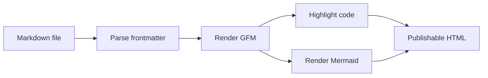

# Markdown Artifact Preview

This document exercises the rendering surface that pagebin would need for agent-generated Markdown artifacts: GitHub flavored Markdown, syntax highlighted code, frontmatter, tables, task lists, and Mermaid diagrams.

> **Note:** Frontmatter is parsed once, removed from the body, and rendered in a uniform metadata rail.

## Rendering Contract

- [x] GitHub flavored Markdown tables and task lists
- [x] Syntax highlighted fenced code blocks
- [x] Mermaid diagrams using the same dark theme
- [x] YAML frontmatter rendered predictably
- [ ] Integration with `pagebin publish`

| Area | Behavior | Prototype state |
| --- | --- | --- |
| Frontmatter | Extract and render as metadata | Complete |
| Code | Highlight known languages, escape unknown code | Complete |
| Mermaid | Render `mermaid` fences as diagrams | Complete |
| Export | Copy current rendered HTML | Basic |

## Example Flow



## Code Block

```ts
interface PublishOptions {
  ttl?: string;
  sandbox: "strict" | "relaxed";
  format: "html" | "markdown";
}

export function shouldRenderMarkdown(fileName: string): boolean {
  return /\.md(?:own)?$/i.test(fileName);
}
```

```nix
let
  markdownExtensions = [ ".md" ".markdown" ];
in
lib.any (ext: lib.hasSuffix ext fileName) markdownExtensions
```

## Details

<details>
<summary>Renderer notes</summary>

Inline HTML survives sanitization when safe, while scripts and event handlers are removed. That keeps generated artifacts useful without making the published page an arbitrary script runner.

</details>

## Footnote Shape

GitHub-style footnotes are common in generated reports.[^1]

[^1]: This prototype keeps the default Markdown behavior for unsupported extensions, so integration can choose whether to add stricter parity.
