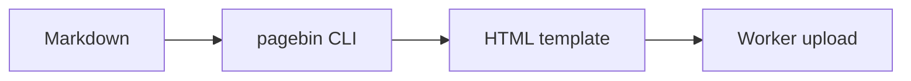

# Agent Report

This fixture represents the kind of Markdown artifact an agent might produce while working.

> **Note:** The renderer should show frontmatter as properties and keep this body focused on the report.

## Checklist

- [x] Render GitHub-flavored Markdown
- [x] Highlight code blocks
- [x] Render Mermaid diagrams
- [ ] Publish the final integration

| Area | Expected behavior | Status |
| --- | --- | --- |
| Frontmatter | Rendered as properties | Ready |
| Tables | Scroll without breaking columns | Ready |
| Code | Line numbers and copy button | Ready |

## Flow



## Code

```ts
interface Artifact {
  filename: string;
  html: string;
}
```
